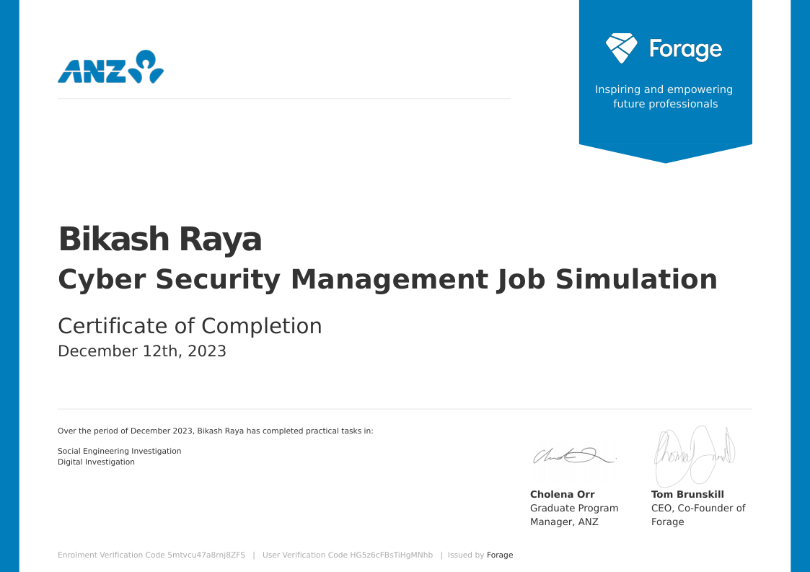

# 🛡️ ANZ Cyber Security Management Simulation

### Forage Virtual Experience Program

---

**Completed by:** Bikash Raya  
**Date:** ADD DATE

---

## 📋 Overview

This repository documents my completion of the **ANZ Cyber Security Management Virtual Experience Program**.  
The simulation focused on **phishing detection** and **network forensics**, involving real-world analysis of suspicious emails and packet capture (PCAP) data.

---

## 🎯 Simulation Objectives

| Task | Description | Status |
|------|-------------|--------|
| **Task 1** | Social Engineering Investigation (Phishing Analysis) | ✅ Completed |
| **Task 2** | Digital Investigation (PCAP Network Forensics) | ✅ Completed |

---

## 🔍 What I Did

- 📧 Analysed phishing emails to identify malicious patterns and social engineering tactics  
- 🌐 Investigated network traffic using packet capture (.pcap) files  
- 🧪 Performed file carving from raw network streams  
- 🔐 Recovered hidden and encoded data (Base64, embedded content)  
- 🕵️ Identified suspicious artifacts including images, documents, and archives  
- 📊 Correlated findings to detect potential malicious activity  

---

## 📁 Repository Structure

| Directory | Description |
|-----------|-------------|
| [📂 Task-1-Phishing-Analysis](./Task-1-Phishing-Analysis) | Email investigation and phishing detection |
| [📂 Task-2-PCAP-Investigation](./Task-2-PCAP-Investigation) | Network traffic analysis and file extraction |

---

## 🧠 Skills Demonstrated

| Technical Skills | Tools & Technologies | Concepts |
|------------------|---------------------|----------|
| Network Traffic Analysis | Wireshark | Packet Inspection |
| Phishing Detection | HxD Hex Editor | Social Engineering |
| File Carving | HTTP Stream Analysis | Data Encoding |
| Digital Forensics | Base64 Decoding | Steganography Awareness |

---

## 🔬 Key Technical Findings

### 📧 Phishing Investigation
- Identified **4 malicious emails** out of 7 samples  
- Detected:
  - Suspicious sender domains  
  - Malicious/obfuscated URLs  
  - Social engineering indicators (urgency, formatting anomalies)  

---

### 🌐 Network Forensics (PCAP Analysis)

- Filtered HTTP traffic to isolate relevant activity  
- Identified:
  - Abnormal GET request patterns  
  - Multiple file transfers (images, PDFs, DOCX)  
- Followed TCP streams to reconstruct transmitted data  

---

### 🧪 Evidence Extraction

- 🖼️ Extracted images using hex signatures:
  - `FFD8` → Start of JPEG  
  - `FFD9` → End of JPEG  

- 🔍 Discovered:
  - Hidden messages embedded within image streams  
  - Encoded files (Base64 → PNG reconstruction)  
  - Misleading file formats (e.g., .txt acting as image data)  

---

### 🔐 Advanced Findings

- Recovered password-protected archive via traffic inspection  
- Identified gzip-compressed content and extracted underlying files  
- Detected covert data embedding techniques in network traffic  

---

## 🎯 Key Insight

> Network traffic can contain hidden, encoded, or disguised data that requires deep inspection beyond standard filtering techniques.

---
## 📜 Certificate of Completion

**Verification Code:** `5mtvcu47a8rnj8ZFS`

*Issued by Forage | Signed by Cholena Orr, Graduate Program Manager, ANZ | Tom Brunskill, CEO & Co-Founder, Forage*

## 🔗 Connect With Me

---

**⭐ If you found this helpful, consider giving it a star! ⭐**

